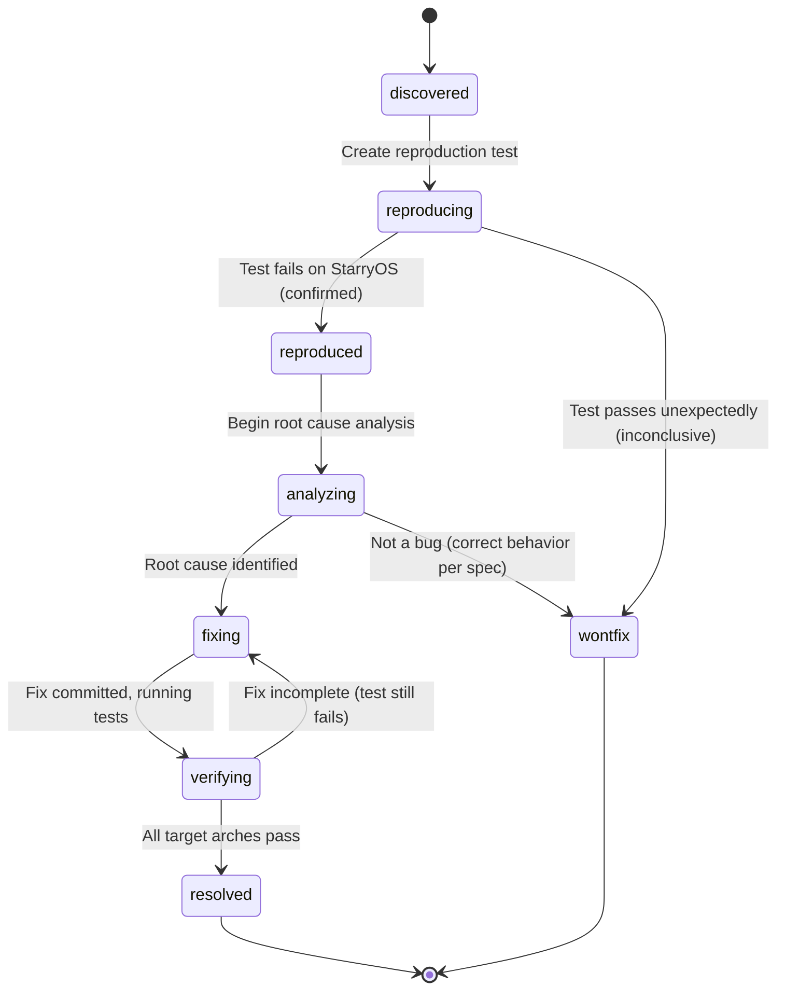

# Design Document: Starry Bug Workflow

## Overview

This design describes how Kiro orchestrates an end-to-end bug discovery and fix workflow for StarryOS. The workflow is not a separate software system — it is a sequence of operations that Kiro performs using existing MCP tools (`create_tgoskits_test`, `run_tgoskits_test`, `run_tgoskits_test_on_linux_host`, Git Guard tools) and subagents (`linux-standard-checker`), coordinated by Kiro's own reasoning.

The workflow has six phases:

1. **Discovery** — User names syscalls → Kiro reads man pages → generates a comprehensive test → runs on Linux and StarryOS → diffs results
2. **Reporting** — Kiro produces structured bug reports from the diff
3. **Reproduction** — Kiro creates targeted per-bug tests on `agent-bugfix-*` branches
4. **Analysis** — Kiro traces root cause using kernel source, errno comparison, and the linux-standard-checker agent
5. **Fix & Verify** — Kiro implements the fix, runs the reproduction test, expands to other architectures
6. **Commit Cleanup** — Kiro squashes intermediate commits on each branch to maintain a clean history
7. **PR Generation** — Kiro writes a PR message to `tgoskits/tmp/pr/<bug-name>.md`

Throughout, Kiro tracks each bug's lifecycle state.

## Architecture

The workflow is a linear pipeline with feedback loops. Kiro is the sole orchestrator; there are no new components to build.

```mermaid
flowchart TD
    A["User: 'test mmap and brk'"] --> B["Phase 1: Discovery"]
    B --> B1["Read man pages via shell"]
    B1 --> B2["Identify edge cases & error conditions"]
    B2 --> B3["create_tgoskits_test: scaffold test-<syscall>"]
    B3 --> B4["Git Guard: reset dev → create agent-test-<syscall>"]
    B4 --> B5["Write comprehensive C test source"]
    B5 --> B6["run_tgoskits_test_on_linux_host → Linux Baseline"]
    B6 --> B7["run_tgoskits_test (riscv64) → StarryOS result"]
    B7 --> C["Phase 2: Reporting"]
    C --> C1{"StarryOS fails where Linux passes?"}
    C1 -- Yes --> C2["Generate Bug Report per failing check"]
    C1 -- No --> C3["No bugs found — report clean"]
    C2 --> D["Phase 3: Reproduction"]
    D --> D1["Git Guard: reset dev → create agent-bugfix-<name>"]
    D1 --> D2["create_tgoskits_test: scaffold bug-<syscall>-<desc>"]
    D2 --> D3["Write targeted C test for single failure"]
    D3 --> D4["run_tgoskits_test (riscv64): confirm failure"]
    D4 --> D5{"Reproduces?"}
    D5 -- No --> D6["Flag as inconclusive"]
    D5 -- Yes --> E["Phase 4: Analysis"]
    E --> E1["Parse test source for syscall invocations"]
    E1 --> E2["Map syscall → StarryOS kernel module"]
    E2 --> E3["Compare observed vs expected errno"]
    E3 --> E4{"Ambiguous semantics?"}
    E4 -- Yes --> E5["Invoke linux-standard-checker agent"]
    E4 -- No --> F["Phase 5: Fix & Verify"]
    E5 --> F
    F --> F1["Implement fix on agent-bugfix-<name> branch"]
    F1 --> F2["run_tgoskits_test (riscv64): verify fix"]
    F2 --> F3{"Passes?"}
    F3 -- No --> F4["Report fix incomplete"]
    F3 -- Yes --> F5["run_tgoskits_test on remaining arches"]
    F5 --> F6["Git Guard: rebase against upstream/dev"]
    F6 --> F7["Phase 6: Commit Cleanup"]
    F7 --> F7a["Squash agent-bugfix-* to 2 commits: test + fix"]
    F7a --> F7b["Merge agent-bugfix-* into agent-test-* branch"]
    F7b --> G["Phase 7: PR Generation"]
    G --> G1["Write PR to tgoskits/tmp/pr/<bug-name>.md"]
    G1 --> H["Done"]
```



### Tool Composition

| Workflow Step | MCP Tool / Agent | Purpose |
|---|---|---|
| Read man pages | `shell: man <syscall>` | Extract specification, edge cases, error codes |
| Scaffold test | `create_tgoskits_test` | Create directory with QEMU configs, CMake, stub C |
| Linux baseline | `run_tgoskits_test_on_linux_host` | Compile & run natively with gcc |
| StarryOS test | `run_tgoskits_test` | Run in Docker/QEMU on StarryOS |
| Branch management | `reset_branch_to_upstream`, `create_agent_branch`, `switch_branch`, `run_git_command` | Safe branch creation, commits, rebasing |
| Standard verification | `linux-standard-checker` agent | Yes/no answers about POSIX/Linux semantics |

### Decision Points

1. **Shared failure filter** — If a check fails on both Linux and StarryOS with the same exit code, it is excluded from the bug list (test bug, not OS bug).
2. **Reproduction gate** — If the targeted reproduction test passes unexpectedly on StarryOS, the bug is flagged as inconclusive; no fix branch is created.
3. **Architecture expansion gate** — Other architectures are only tested after riscv64 passes.
4. **Fix completeness gate** — If the reproduction test still fails after the fix commit, the workflow reports incomplete and stops.

## Components and Interfaces

Since this is an orchestration workflow (not new software), "components" here are the logical phases Kiro executes and the interfaces between them.


### Phase 1: Discovery Interface

**Input:** User's natural language message containing syscall names (e.g., "test mmap and brk").

**Operations:**
1. Parse syscall names from user message.
2. For each syscall, run `man <syscall>` via shell to retrieve the full specification.
3. Analyze the man page output to extract:
   - Normal behavior and return values
   - Error conditions (each `errno` value and when it occurs)
   - Boundary values (e.g., zero-length, negative offsets, `NULL` pointers)
   - Interactions with file types (regular file, pipe, socket, directory)
4. Call `reset_branch_to_upstream("dev")` to ensure latest upstream.
5. Call `create_agent_branch("agent-test-<syscall-or-group>", "dev")`.
6. Call `create_tgoskits_test(test_name="test-<syscall-or-group>")` to scaffold the directory.
7. Write a comprehensive C test source into `<test-dir>/c/src/main.c` that exercises ALL identified edge cases in a single binary. The test uses `PASS`/`FAIL` markers with errno values.
8. Call `run_tgoskits_test_on_linux_host(test_name="test-<syscall-or-group>")` to establish the Linux baseline.
9. Call `run_tgoskits_test(test_name="test-<syscall-or-group>", arch="riscv64")` to get the StarryOS result.

**Output:** Linux baseline result + StarryOS result, both as parsed test output.

### Phase 2: Reporting Interface

**Input:** Linux baseline result + StarryOS result from Phase 1.

**Operations:**
1. Parse both outputs for `PASS`/`FAIL` markers (either `PASS | file:line | msg` format from test_framework.h, or the simpler `PASS: name` / `FAIL: name` format).
2. For each check that passes on Linux but fails on StarryOS, create a Bug Report entry.
3. For checks that fail on both with the same exit code, classify as "shared failure" and exclude.
4. If StarryOS produces no recognizable output (kernel panic before test runs), classify as `crash`.

**Output:** List of Bug Reports, each containing:
- `test_name`: Name of the comprehensive test
- `check_name`: Specific failing check within the test
- `architecture`: riscv64 (initial)
- `syscall`: The syscall under test
- `expected`: Linux behavior (errno, return value)
- `observed`: StarryOS behavior (errno, return value)
- `log_excerpt`: Relevant output lines

### Phase 3: Reproduction Interface

**Input:** Bug Report from Phase 2.

**Operations:**
1. Call `reset_branch_to_upstream("dev")`.
2. Call `create_agent_branch("agent-bugfix-<syscall>-<short-description>", "dev")`.
3. Call `create_tgoskits_test(test_name="bug-<syscall>-<short-description>")`.
4. Write a focused C test that reproduces only the specific failing edge case.
5. Call `run_tgoskits_test(test_name="bug-<syscall>-<short-description>", arch="riscv64")`.
6. If the test passes unexpectedly, flag as inconclusive.

**Output:** Confirmed reproduction (test fails on StarryOS) or inconclusive flag.

### Phase 4: Analysis Interface

**Input:** Reproduced bug with its test source and output.

**Operations:**
1. Parse the reproduction test source for syscall invocations (e.g., `lseek`, `mmap`, `pread`).
2. Map the syscall to the StarryOS kernel handler (e.g., `sys_lseek` in `kernel/src/syscall/fs/io.rs`).
3. Compare observed errno against expected errno from the Bug Report.
4. If the semantics are ambiguous (e.g., "should mmap with MAP_FIXED and addr=0 return EINVAL?"), invoke the `linux-standard-checker` agent with a specific yes/no question.
5. Update the Bug Report with root cause analysis.

**Output:** Root cause description, affected kernel module, and confirmed expected behavior.

### Phase 5: Fix & Verify Interface

**Input:** Root cause analysis from Phase 4.

**Operations:**
1. Switch to the `agent-bugfix-<name>` branch (already created in Phase 3).
2. Implement the fix in the StarryOS kernel source.
3. Commit via `run_git_command(["commit", "-am", "<message>"])` with bug name, syscall, and test reference.
4. Call `run_tgoskits_test(test_name="bug-<syscall>-<desc>", arch="riscv64")` to verify.
5. If the test still fails, report fix as incomplete and stop.
6. If the test passes on riscv64, run on remaining architectures: `x86_64`, `aarch64`, `loongarch64`.
7. Record per-architecture pass/fail status.
8. Call `run_git_command(["rebase", "upstream/dev"])` before finishing.

**Output:** Per-architecture verification results.

### Phase 6: Commit Cleanup Interface

**Input:** Completed `agent-bugfix-*` branch with fix verified on all target architectures.

**Operations:**
1. On the `agent-bugfix-*` branch, inspect the commit log to count commits.
2. If there are more than two commits, use `run_git_command(["rebase", "-i", "dev"])` (interactive rebase) to squash them into exactly two commits: one for the reproduction test case, one for the OS fix.
3. Switch to the `agent-test-*` branch.
4. Merge the cleaned-up `agent-bugfix-*` branch into `agent-test-*` via `run_git_command(["merge", "agent-bugfix-<name>"])`.
5. Repeat for each bug's `agent-bugfix-*` branch.

**Output:** The `agent-test-*` branch contains `1 + N` commits: the original comprehensive test commit plus one merge commit per bug. Each `agent-bugfix-*` branch contains exactly two commits (test + fix).

### Phase 7: PR Generation Interface

**Input:** Verified fix with test results across architectures.

**Operations:**
1. Generate a PR message following the structure in `tgoskits/tmp/pr/example-lseek-pipe-espipe.md`:
   - Title (as markdown H1)
   - Summary
   - Root Cause
   - Fix
   - Testing
   - Architecture Notes (if applicable)
2. Write to `tgoskits/tmp/pr/<bug-name>.md`.

**Output:** PR message file.

## Data Models

### Bug Report Structure

Each bug discovered by the workflow is tracked with the following fields:

```
BugReport {
    id: string                    // e.g., "mmap-null-addr-einval"
    state: BugState               // lifecycle state
    syscall: string               // e.g., "mmap"
    test_name: string             // comprehensive test name, e.g., "test-mmap-family"
    check_name: string            // specific check, e.g., "mmap(NULL, 0, ...) returns EINVAL"
    branch: string                // e.g., "agent-bugfix-mmap-null-addr"
    expected: TestResult          // from Linux baseline
    observed: TestResult          // from StarryOS
    arch_results: Map<Arch, TestVerdict>  // per-arch pass/fail after fix
    root_cause: string?           // filled during analysis
    fix_description: string?      // filled during fix
    pr_path: string?              // e.g., "tgoskits/tmp/pr/mmap-null-addr-einval.md"
    timestamps: Map<BugState, datetime>   // state transition log
}
```

### Bug State Machine



### Test Output Structure

Parsed from both `run_tgoskits_test` and `run_tgoskits_test_on_linux_host`:

```
TestResult {
    verdict: "success" | "failed" | "crash" | "timeout" | "build_failed" | "unrecognized"
    exit_code: int
    checks: List<CheckResult>     // individual PASS/FAIL lines
    raw_output: string            // full output when needed
}

CheckResult {
    status: "pass" | "fail"
    file: string                  // source file
    line: int                     // line number
    message: string               // check description
    errno: int?                   // errno value if present
    errno_name: string?           // e.g., "ESPIPE"
}
```

### Test Naming Conventions

| Purpose | Name Pattern | Branch Pattern | Example |
|---|---|---|---|
| Comprehensive discovery test | `test-<syscall-or-group>` | `agent-test-<syscall-or-group>` | `test-mmap-family` / `agent-test-mmap-family` |
| Bug reproduction test | `bug-<syscall>-<short-desc>` | `agent-bugfix-<syscall>-<short-desc>` | `bug-mmap-null-einval` / `agent-bugfix-mmap-null-einval` |

### Test File Layout

All tests live under `tgoskits/test-suit/starryos/normal/`:

```
<test-name>/
├── qemu-x86_64.toml
├── qemu-aarch64.toml
├── qemu-riscv64.toml
├── qemu-loongarch64.toml
└── c/
    ├── CMakeLists.txt
    ├── prebuild.sh
    └── src/
        └── main.c
```

### Workflow State Summary

Kiro maintains an in-conversation summary of all tracked bugs:

```
Workflow Summary {
    syscalls_under_test: List<string>
    comprehensive_test: string          // test name
    bugs: List<BugReport>
    bugs_by_state: Map<BugState, List<BugReport>>
}
```

This is maintained in Kiro's conversation context, not persisted to disk. The durable artifacts are the test directories, git branches, and PR message files.


## Correctness Properties

*A property is a characteristic or behavior that should hold true across all valid executions of a system — essentially, a formal statement about what the system should do. Properties serve as the bridge between human-readable specifications and machine-verifiable correctness guarantees.*

### Property 1: Syscall Name Extraction

*For any* natural language message containing one or more valid Linux syscall names (e.g., "test mmap and brk", "check lseek"), the syscall name parser should extract exactly the set of valid syscall names present in the message, with no false positives (non-syscall words) and no false negatives (missed syscall names).

**Validates: Requirements 1.1**

### Property 2: Naming Convention Compliance

*For any* valid syscall name and optional short description string, the generated test name (`test-<syscall>` or `bug-<syscall>-<desc>`) and corresponding branch name (`agent-test-<syscall>` or `agent-bugfix-<syscall>-<desc>`) should match the required naming patterns, and the branch name should always start with `agent`.

**Validates: Requirements 1.3, 3.1, 5.2**

### Property 3: Bug Classification from Result Pairs

*For any* pair of (Linux baseline result, StarryOS result) where each check has a pass/fail status and an exit code:
- If a check passes on Linux but fails on StarryOS, it should be classified as a candidate bug.
- If a check fails on both Linux and StarryOS with the same exit code, it should be classified as a shared failure and excluded from the candidate bug list.
- The set of candidate bugs and shared failures should be disjoint and their union should cover all divergent checks.

**Validates: Requirements 1.5, 1.6**

### Property 4: Bug Report Completeness

*For any* candidate bug identified by the classification logic, the generated Bug Report should contain all required fields (test name, architecture, syscall, expected behavior, observed behavior, exit code, log excerpt), should include every individual failing check with its file, line number, message, and errno value, and should record per-architecture pass/fail status for every architecture that was tested.

**Validates: Requirements 2.1, 2.2, 2.3, 4.3, 8.2**

### Property 5: QEMU Config Scaffold Completeness

*For any* test name passed to the test scaffold, the generated test directory should contain exactly four QEMU config files (`qemu-x86_64.toml`, `qemu-aarch64.toml`, `qemu-riscv64.toml`, `qemu-loongarch64.toml`), each containing valid `success_regex` and `fail_regex` patterns.

**Validates: Requirements 3.2**

### Property 6: Git Guard Branch Safety

*For any* branch name that does not start with `agent`, the Git Guard should reject arbitrary git command execution. Conversely, for any branch name starting with `agent`, git commands should be permitted.

**Validates: Requirements 5.3**

### Property 7: Commit Message Completeness

*For any* fix commit generated by the workflow, the commit message should contain the bug name, the affected syscall name, and a reference to the reproduction test name.

**Validates: Requirements 5.4**

### Property 8: PR Message Structure and Path

*For any* verified bug fix with a bug name, the generated PR message should contain all required sections (Title, Summary, Root Cause, Fix, Testing, and optionally Architecture Notes), and should be written to the path `tgoskits/tmp/pr/<bug-name>.md`.

**Validates: Requirements 7.1, 7.2, 7.3**

### Property 9: Bug State Machine Invariant

*For any* bug tracked by the workflow, its state should always be one of the valid states (`discovered`, `reproducing`, `reproduced`, `analyzing`, `fixing`, `verifying`, `resolved`, `wontfix`), and every state transition should have a recorded timestamp and triggering event. No bug should transition to a state that is not reachable from its current state according to the state diagram.

**Validates: Requirements 9.1, 9.2**

### Property 10: Bug Summary Grouping

*For any* set of tracked bugs, the summary view should group bugs by their current state, and the total count of bugs across all groups should equal the total number of tracked bugs (no bugs lost or duplicated).

**Validates: Requirements 9.3**

### Property 11: Test Output Parsing

*For any* test executor output containing verdict strings (`SUCCESS PATTERN MATCHED`, `FAIL PATTERN MATCHED`) or test framework markers (`PASS | file:line | msg`, `FAIL | file:line | msg | errno=N`), the parser should extract all markers with correct file, line, message, and errno fields. The number of parsed check results should equal the number of marker lines in the output.

**Validates: Requirements 10.1, 10.2**

### Property 12: Test Output Round-Trip

*For any* valid test output string, parsing it into a structured `TestResult`, normalizing it, and then re-serializing it back to a string should produce an output that, when parsed again, yields an equivalent `TestResult`.

**Validates: Requirements 10.4**

### Property 13: Commit Hygiene

*For any* `agent-bugfix-*` branch that is presented as ready for review, the branch should contain at most two commits relative to its base (`dev`): one for the reproduction test case and one for the OS fix. *For any* `agent-test-*` branch that is presented as ready for review, the branch should contain exactly `1 + N` commits relative to its base: one for the comprehensive test case and N merge commits (one per bug). No work-in-progress, fixup, or debugging commits should remain on any branch presented as ready.

**Validates: Requirements 11.1, 11.2, 11.3, 11.4**

## Error Handling

### Test Execution Errors

| Error Condition | Handling |
|---|---|
| Compilation failure (host gcc) | Record as `build_failed` in TestResult. Include compiler output in Bug Report. Do not proceed to StarryOS testing for this test. |
| Compilation failure (QEMU/Docker) | Record as `build_failed`. The Docker build step may take minutes; this is normal. Only flag as error if the build itself fails. |
| QEMU timeout | Record as `timeout` in TestResult. The timeout starts after the shell prompt appears (`root@starry:/root`), not during compilation. Default 300s. |
| Kernel panic before test output | Record as `crash`. Include available serial output in Bug Report. |
| No recognizable output | Record as `unrecognized`. Suggest rerunning with `full_output=True`. |
| Docker/network error | Report the system error. Do not classify as a test failure. |

### Git Guard Errors

| Error Condition | Handling |
|---|---|
| Branch not in resettable list | `reset_branch_to_upstream` rejects. Kiro should verify `dev` is in `GIT_RESETTABLE_BRANCHES`. |
| No upstream configured | Report error. User must configure `upstream` remote. |
| Rebase conflict | Report the conflict. User must resolve manually. |
| Commit on non-agent branch | `run_git_command` rejects. Kiro should switch to the correct agent branch first. |

### Workflow State Errors

| Error Condition | Handling |
|---|---|
| Reproduction test passes unexpectedly | Transition bug to `wontfix` with reason "inconclusive — reproduction failed". Flag for manual review. |
| Fix verification fails | Keep bug in `fixing` state. Report the updated test output. Do not proceed to other architectures. |
| Linux baseline also fails | Classify as shared failure. Exclude from bug list. May indicate a test bug. |
| linux-standard-checker returns INCONCLUSIVE | Document the ambiguity in the Bug Report. Proceed with the most conservative interpretation (assume StarryOS behavior is wrong unless proven otherwise). |

### Architecture-Specific Errors

| Error Condition | Handling |
|---|---|
| Test passes on riscv64 but fails on another arch | Record per-arch status. Note in PR message under Architecture Notes. May indicate an arch-specific bug requiring a separate fix. |
| Test only has configs for some arches | Only test architectures that have a `qemu-<arch>.toml` config. Do not fail the workflow for missing arch configs. |
